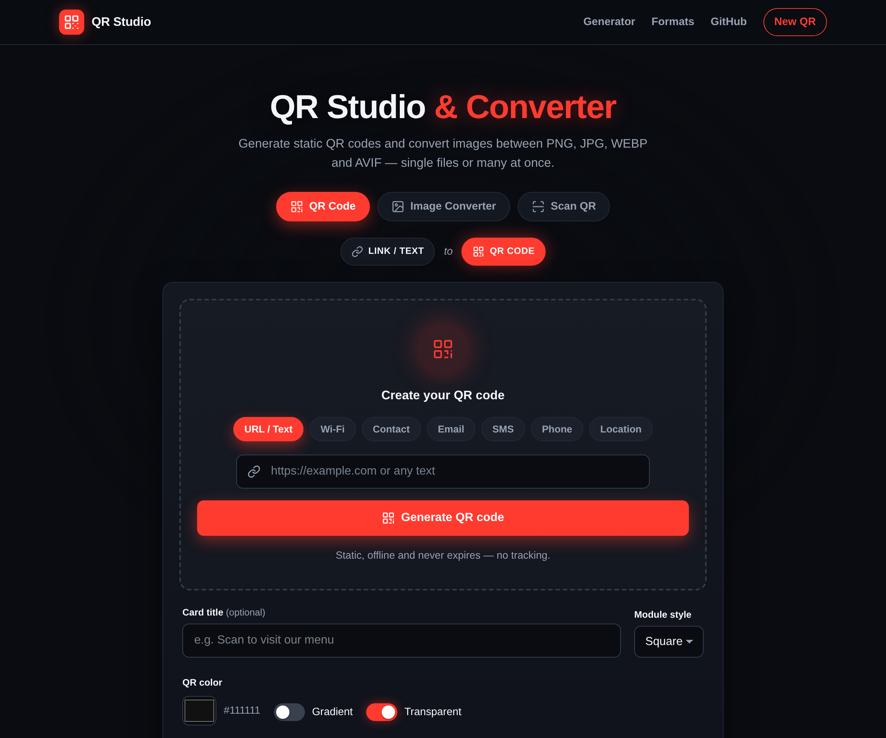
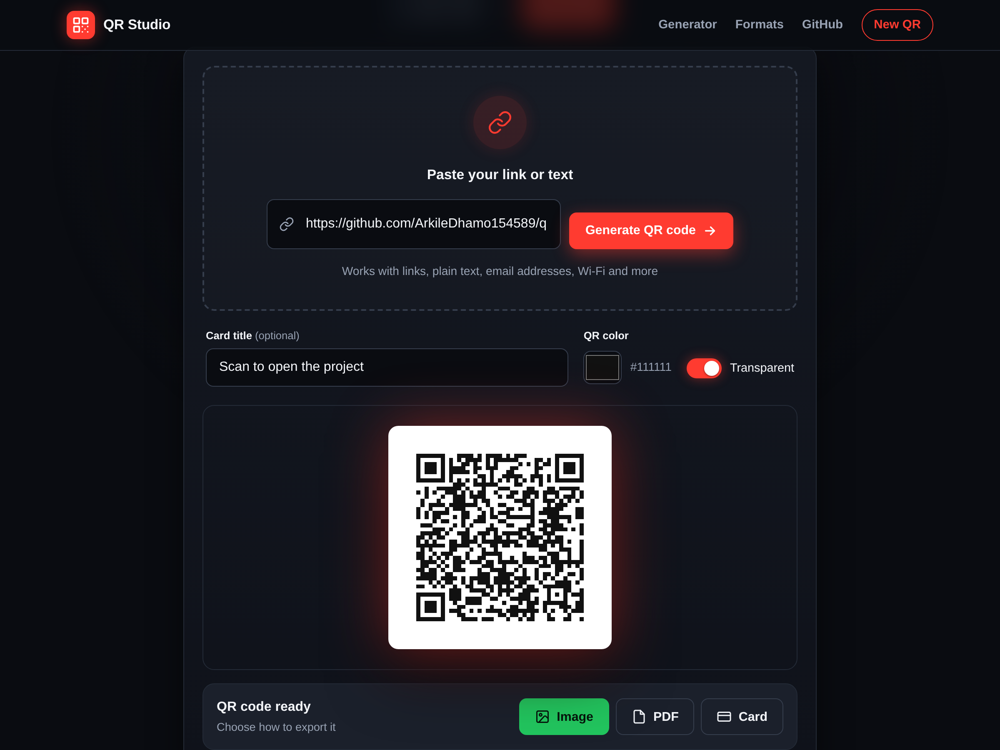
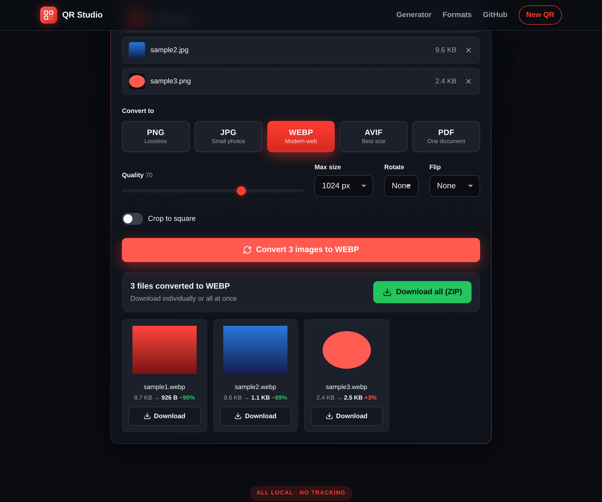
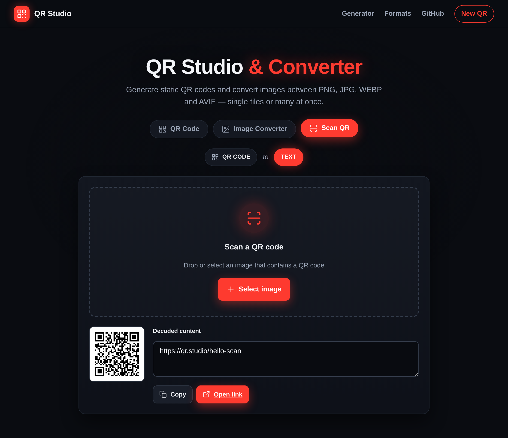
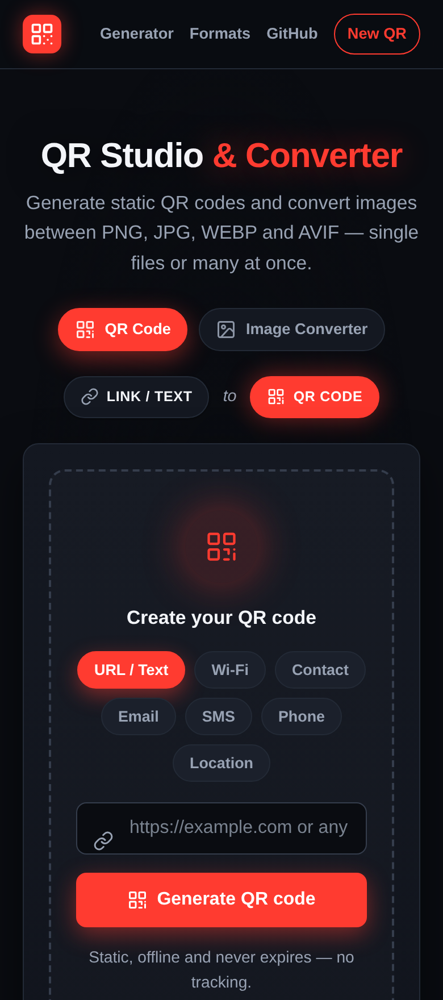
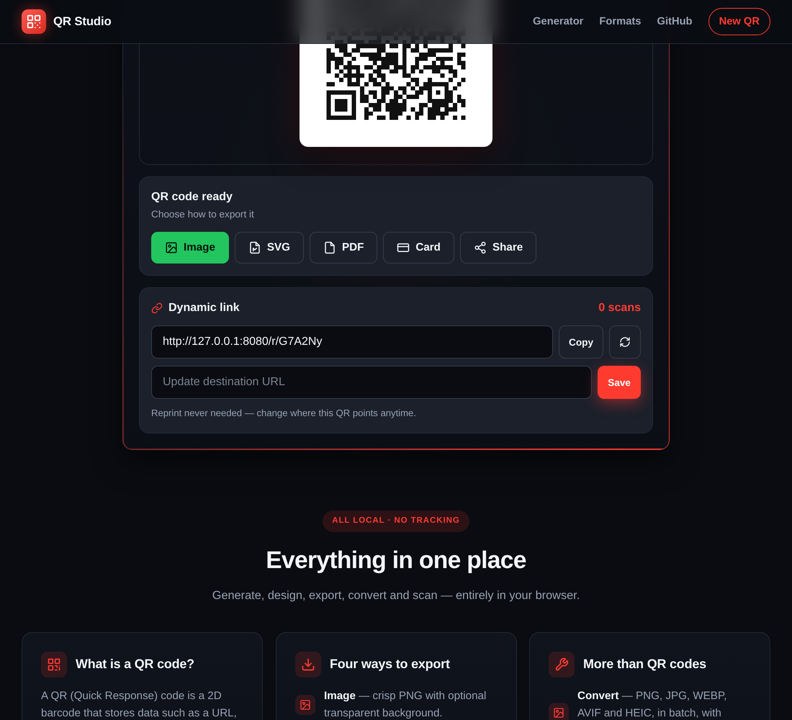

# QR Studio & Converter

A fast, local-first **QR code generator** and **image converter** built with
Flask. Turn any link or text into a static QR code, or batch-convert images
between PNG, JPG, WEBP and AVIF — all in a dark, CloudConvert-style interface
with a live 3D animated background.



## Features

**QR codes**
- Multiple content types: **URL / text, Wi-Fi, contact (vCard), email, SMS, phone and location**
- Design options: **module styles** (square, rounded, dots, gapped), **color gradient**,
  transparent background and a **center logo**
- Export four ways: **Image** (transparent PNG), **SVG** (vector), **PDF** (A4) and **Card** (business-card)
- **Dynamic QR codes** — a short link you can re-point anytime, with **scan analytics**
- **Bulk generation** — paste a list and download every QR as a single ZIP
- **Recent history** and a **shareable config link** that rebuilds the QR
- Static codes that never expire and are not tracked

**Image converter**
- Convert between **PNG, JPG, WEBP and AVIF** in any direction, plus **HEIC input** (iPhone photos)
- **Batch**: drop or select many files and convert them all at once
- **Quality** control, optional **resize**, **rotate**, **flip** and **crop to square**
- **Combine images into a single PDF**
- Live **compression stats** (original size, new size, percent saved)
- Per-file download or **Download all** as a single ZIP

**Scan QR**
- Read a QR code from an uploaded image **or live from the camera**, then copy or open its content

**Everything else**
- **Installable PWA** that works offline
- 3D animated background (three.js) and tilt / hover interactions
- Mobile-first responsive layout
- No database, no third-party APIs — runs fully offline once installed

## Screenshots

| Generated QR + export | Image converter | Scan QR | Mobile |
| --- | --- | --- | --- |
|  |  |  |  |

Dynamic QR codes with editable destination and live scan analytics:



## Tech stack

- Flask (Python)
- qrcode + Pillow for QR generation and image conversion (native WEBP/AVIF)
- three.js (animated background)
- jsPDF (client-side PDF and card export, vendored locally)
- gunicorn (production server)

## Run locally

```bash
python -m venv venv
source venv/bin/activate          # Windows: venv\Scripts\activate
pip install -r requirements.txt
flask --app app run --debug
```

Then open http://127.0.0.1:5000

To make it reachable from other devices on your network (e.g. a phone):

```bash
flask --app app run --host 0.0.0.0 --port 8080
```

Open `http://<your-computer-ip>:8080`. Avoid browser-blocked ports such as
5060/5061; 8080 and 8000 are safe.

## Deploy to Render

This repo is ready for [Render](https://render.com):

- A `render.yaml` blueprint and a `Procfile` are included.
- Start command: `gunicorn app:app --bind 0.0.0.0:$PORT`
- Build command: `pip install -r requirements.txt`

Create a new Web Service from the repository (or use the blueprint) and Render
will build and start it automatically.

Dynamic QR codes use a local SQLite file (`qrstudio.db`). On Render's free tier
the filesystem is ephemeral, so links reset on redeploy/restart — attach a
persistent disk (or swap to Postgres) if you need them to survive.

## License

Open source. Use it freely for websites, print, or internal tools.

Designed & built by [Achileas Dhamo](https://github.com/ArkileDhamo154589).
